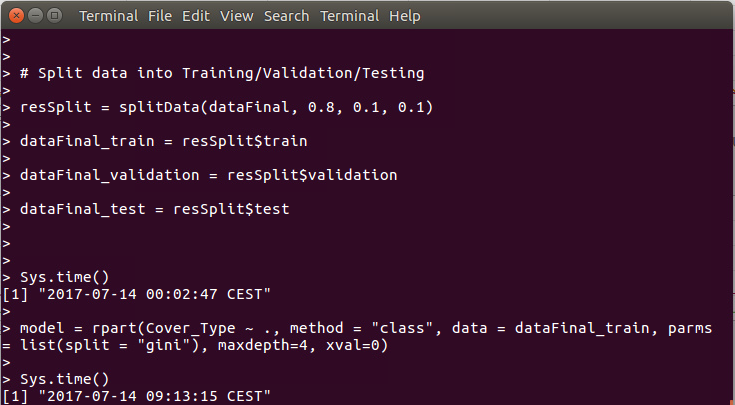

# RandomForest_DecisionTree
Decision Tree and Random Forest in different programming languages.

The Spark part is inspired by the Chapter 4 in the book "Advanced Analytics with Spark - Patterns for Learning from Data at Scale 1st Edition (Sandy Ryza, Uri Laserson, Sean Owen, Josh Wills, Apr-2015)".

Decision Tree training in Spark is much faster than that in R. (several minutes compared to several hours!)

